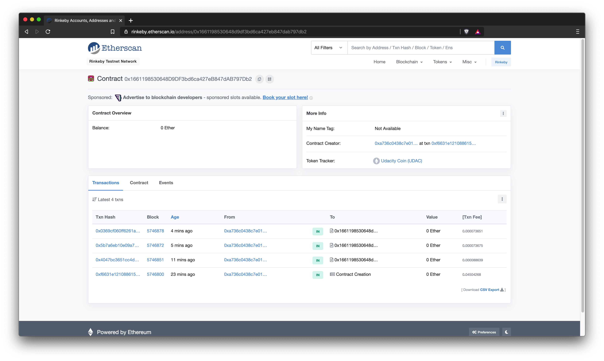
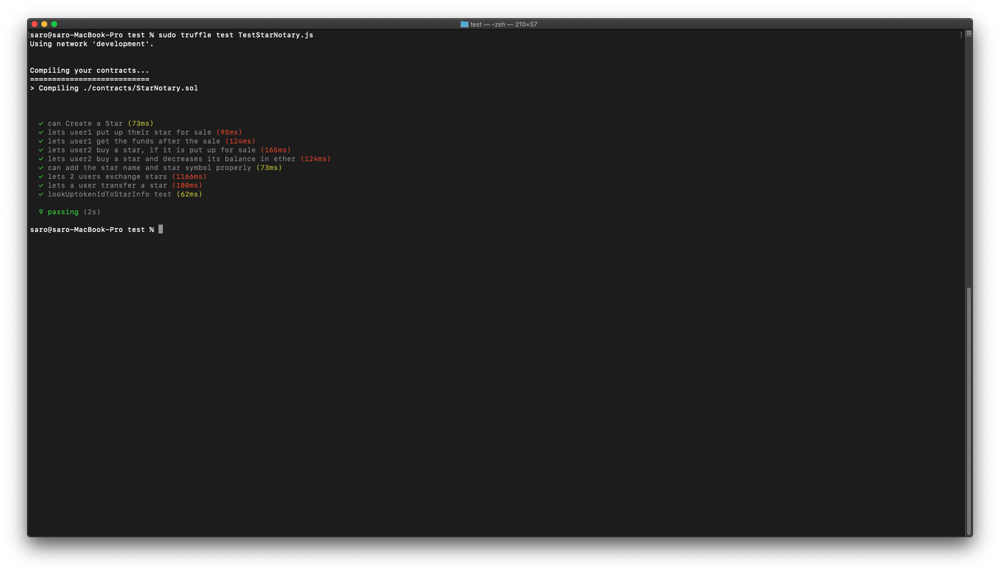
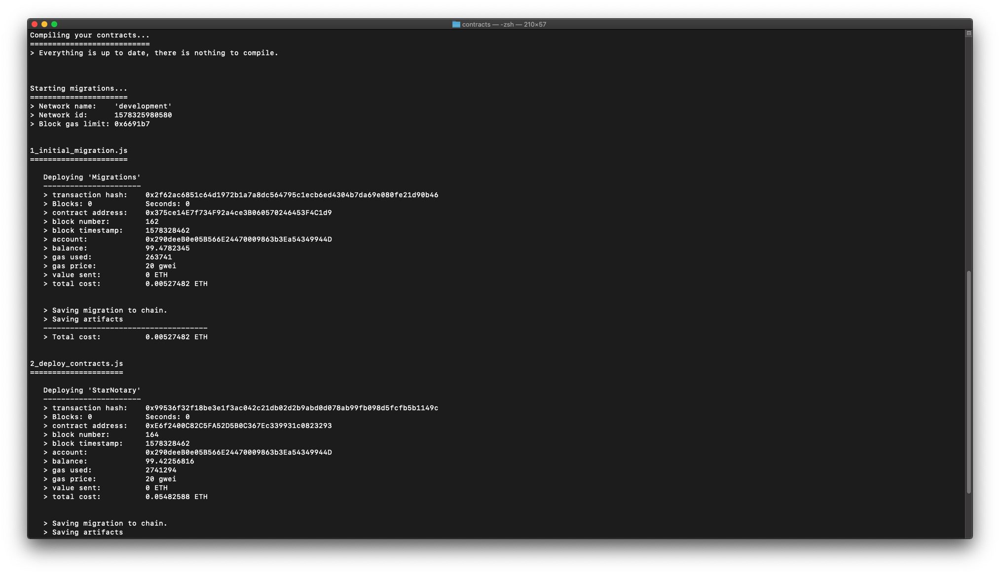
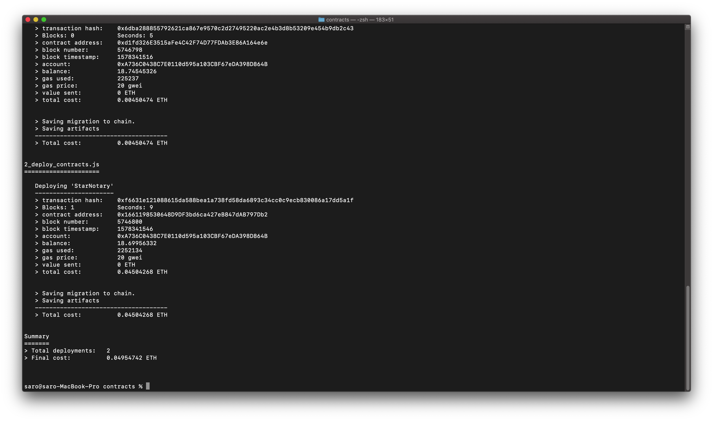
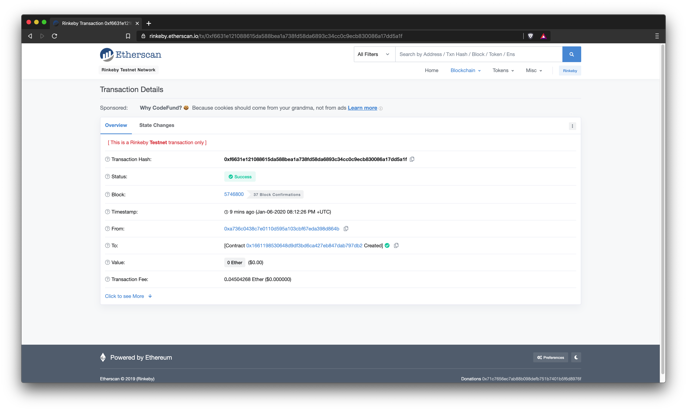
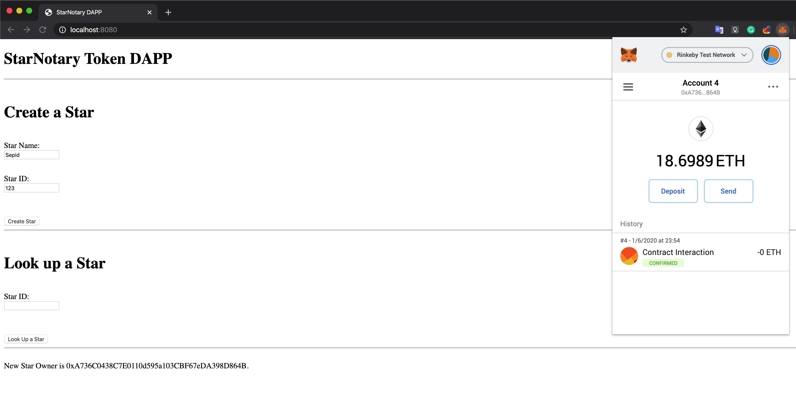
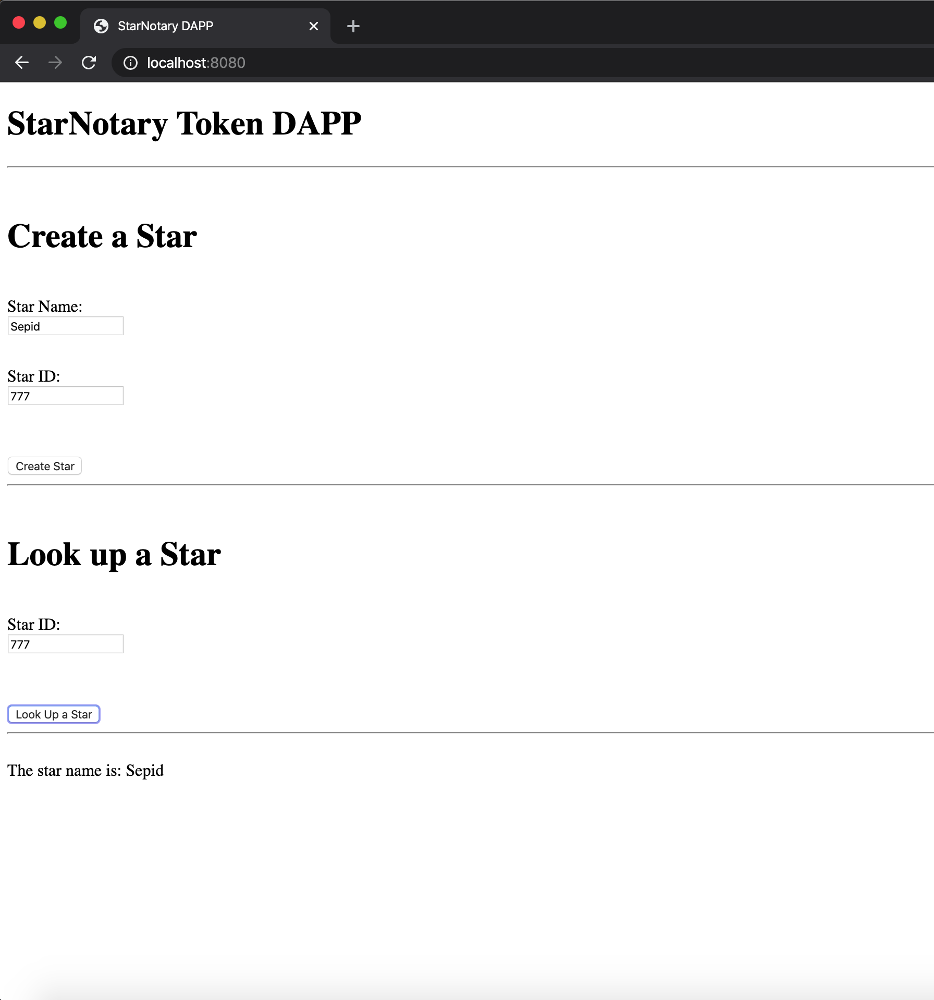

# Decentralized Star Notary

For this project, we will create a DApp by adding functionality to our smart contract and deploy it on the public testnet. To do so, we'll employ our blockchain identity to secure digital assets on the Ethereum platform using a smart contract. We will get to practice our knowledge of the basics of Solidity.

My ERC-721 Token Name is: **Udacity Coin**
My ERC-721 Token Symbol is: **UDAC**


Version of the Truffle that used in this project is: **Truffle v5.1.7 - a development framework for Ethereum**
Version of the OpenZeppelin that used in this project is: **OpenZeppelin 2.4.0** 

_Sepid_


## Test smart contract code coverage

- Go to the command prompt and start ganache-cli
```
ganache-cli
```
- In another command prompt we will open the test folder
```
cd <project name>/test
```
- Let`s execute the test with the following command. You can see my truffle test result in the below screenshot
```
truffle test TestStarNotary.js
```



## Deploy smart contract on a public test network

To deploy the smart contract locally in our ganache local network or in some public network we have to create a truffle-config.js

### Deploy in local ganache network
- Go to the command prompt and start ganache-cli
```
ganache-cli
```
- In another command prompt we will open the contracts folder
```
cd <project name>/contracts
```
- To deploy 
```
truffle deploy --network development
```
- You can see my truffle deploy in the development network in the below screenshot


### Deploy in ethereum public network like Rinkeby
- Open in a command prompt the smart_contracts folder
```
cd <project name>/contracts
```
- To deploy
```
truffle deploy --network rinkeby
```
- You can see my truffle deploy in the rinkeby network in the below screenshot


### My StarNotary contract deployed in Rinkeby test network

To check my result please see the below screen shot files and check the transaction hash in https://etherscan.io website.

## Contract
- Transaction Hash
```
0xf6631e121088615da588bea1a738fd58da6893c34cc0c9ecb830086a17dd5a1f
```



- Contract Address
```
0x1661198530648D9DF3bd6ca427eB847dAB797Db2
```


## Modify client code to interact with smart contract

In this section you could interact with the previous deployed StarNotary smart contract in public Rinkeby test network using a web application.

- Open in a command prompt the smart_contracts folder
```
cd <project name>/app
```
- To start the web service
```
npm run dev
```
- Open in your chrome browser (with metamask plugin already logged-in) the following url
```
http://127.0.0.1:8080
```




